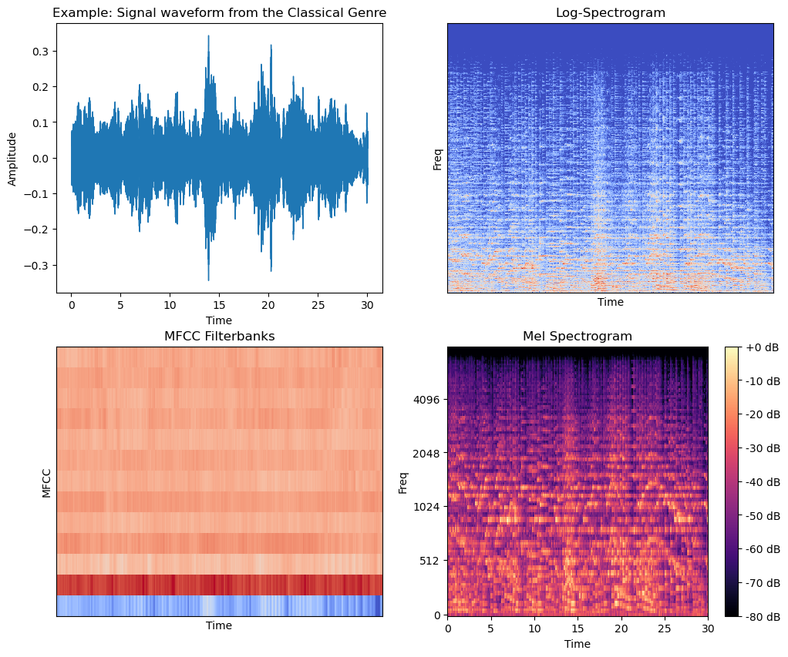

# Audio-Genre-Classification

## Audio Genre Classification on GTZAN dataset using Deep Learning and Speech Signal Processing

## Dataset
The [GTZAN](https://www.kaggle.com/datasets/andradaolteanu/gtzan-dataset-music-genre-classification) dataset collected from Kaggle with 10 different music genres: 'classical', 'blues', 'rock', 'jazz', 'pop', 'disco', 'country', 'hiphop', 'reggae', 'metal'.

The model is trained by starting with a song and splitting it into ten small chunks. Each chunk is pre-processed by extracting mel-frequency cepstral coefficients (MFCCs) over each chunk, producing a spectrogram like the one below:

# Usage

The following steps need to be followed to deploy the code on any machine.

## Environment Setup

Install the prerequisites by creating a new anaconda environment:

	conda env create -f environment.yml
	conda activate agc

## Start the Flask server

In order to test the server functionality with a local flask server, follow the steps. Run the server:

	python app_flask.py 

Then visit `localhost:8080` in your web browser.
            
Or run the following command to test the application created with Streamlit.

    streamlit run app_streamlit.py

## Model Preparation

To recreate the training process, the GTZAN dataset needs to be downloaded to a `data` directory as a `.zip` file.

Then run the `main.py` with the following command in the virtual environment with all the dependencies installed

    python main.py

This script will extract MFCCs (mel-frequency cepstral coefficients) from the `.wav` files and store the 
data and labels in a `.json` file. Also, the MFCC dataset is split into train, validation, and test `.json` files.
Further, a base model is saved which is later trained and stored for prediction and deployment.

##  DVC Functionality

Data Version Control (DVC) was implemented and to reproduce the workflow `dvc.yaml` file can be run with the following command
    
    dvc run -f dvc.yaml

In order to sync and update the changes in the pipeline, run the following command:

    dvc repro

## AWS EC2 instance deployment

This project was containerized with Docker as shown in `Dockerfile`. 
Further, a CI/CD workflow was structured and implemented using Github Actions and AWS EC2 instance. The CI/CD workflow can be found in
`.github/workflows/main.yaml`

<!--1. Update config.yaml
2. Update secrets.yaml [Optional]
3. Update params.yaml
4. Update the entity
5. Update the configuration manager in src config
6. Update the components
7. Update the pipeline
8. Update the main.py
9. Update the dvc.yaml-->

<!--ECR Repo: 925304758738.dkr.ecr.eu-north-1.amazonaws.com/agcapp-->

